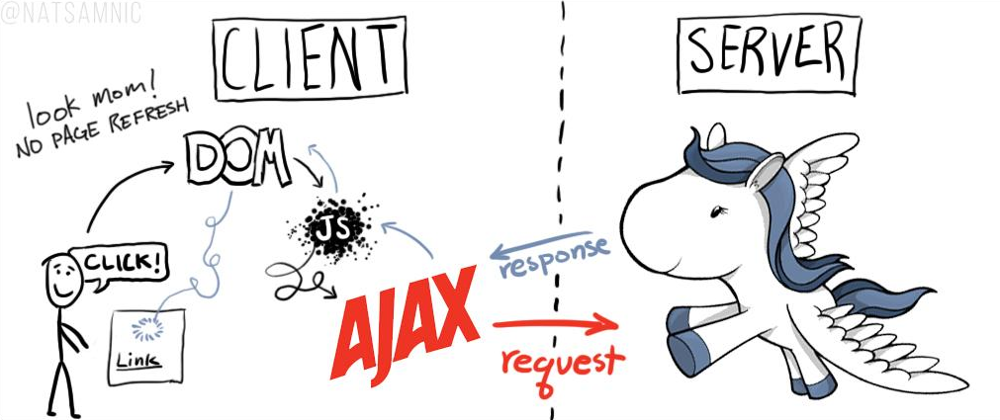
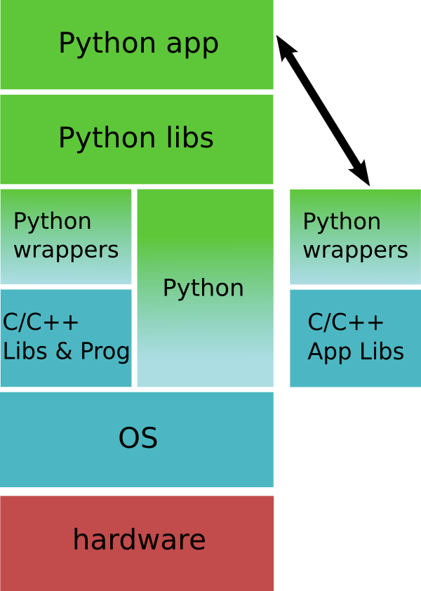

% Intro fun & speedé à Python
% 29/10/2015

# Intro

* Tim, Game developper
* "Python, not for me"
* Deux ans
* Deux bières

# Python not in the browser but everywhere!

# Python on the web

\

* beaucoup d'entreprises

# Everywhere else

* sysadmin (linux distribs)
* desktop app
* big data / science
* 3d

# How ?

# Python is fast for you !

# You know python !

~~~~~
def filter(values, max):
    results = list()
    for val in values:
        if val < max:
            results.append(val)
    return results

class Test(object):
    def do_something(self, a, b):
        return a + b
~~~~~

# Easy to learn, read & write

“I came to Python (...) because it was the best pseudocode. Python has the edge (with a large number of students) when the main goal is communication, not programming per se.”

“Python has the philosophy of making sensible compromises that make the easy things very easy, and don't preclude too many hard things.”  Norvig

* only in two ends.

# First step

* get python
* get pip & venv
    ** pypi
* get ipython
* Experiment & read a lot of code
* Communicate

# Semantics

* everything is an object
* only names, values
* runtime is your friend (repl, no compilation)
* repl

# Fractal & setup

# Let's do it!

* requirements.txt
* setup
* fractal
* best practice

# Web Stuff

* a bit of http
* wsgi
* flask, bottle, django
* sqlalchemy
* celery

# Flask in a slide

~~~~~~~
from flask import Flask

app = Flask(__name__)

@app.route('/')
def index():
    return "hello world"

if __name__ == "__main__":
    app.run(host="0.0.0.0", debug=True)
~~~~~~~

# Except all the others!

# JS : celui qui s'en fout

* arguments
* types
* context (this)
* no class, no module, etc.

~~~~~
In [48]: "1.0" + 1
---------------------------------------------------------------------------
TypeError                                 Traceback (most recent call last)
/home/lionel/<ipython-input-48-6f0b01de9b7a> in <module>()
----> 1 "1.0" + 1

TypeError: cannot concatenate 'str' and 'int' objects
~~~~~

# C#/Java : l'administration soviétique

* utile dans des projets critiques

# Un vrai design de langage

* list comprehension
* magic method
* decorator
* iterator

# Vers l'infini et au delà

* cython
* numpy, opengl
* opencv
* ast manipulation

# Conclusion

* partout
* rapide
* simple
* utile

# Merci à

* @dungeon_dave
* @francois_jourde
* dfi
* @porteneuve
* l'équipe BdN

# Questions

# Secret

~~~~~~~
pandoc -t html5 --template=template-revealjs.html \
--standalone --section-divs \
--variable theme="beige" \
--variable transition="linear" \
--include-in-header=css/specific.css \
slides.md -o slides.html
~~~~~~~
pandoc --slide-level=2 -t html5 --template=template-revealjs.html --standalone --section-divs --variable theme="default" --variable transition="concave" "%" -o "%".html

pandoc -s -S -t revealjs test.md -o test.html --slide-level 2
